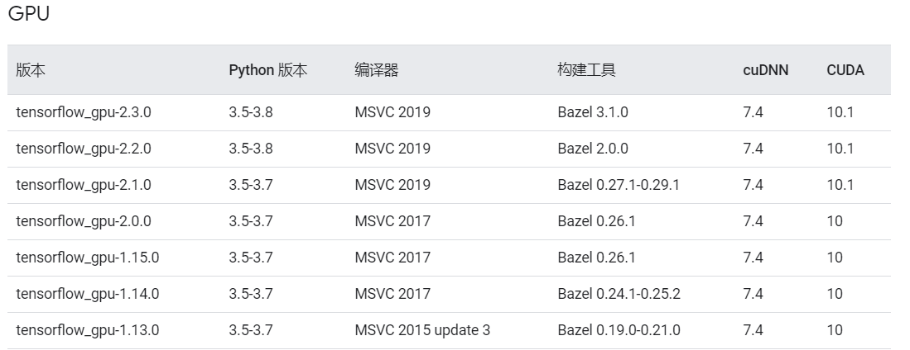
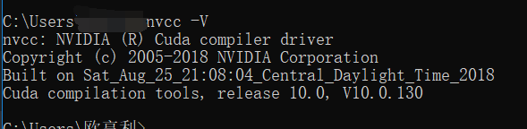
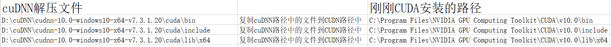
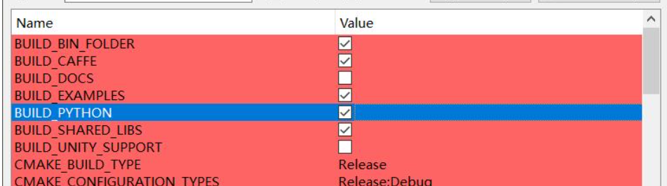
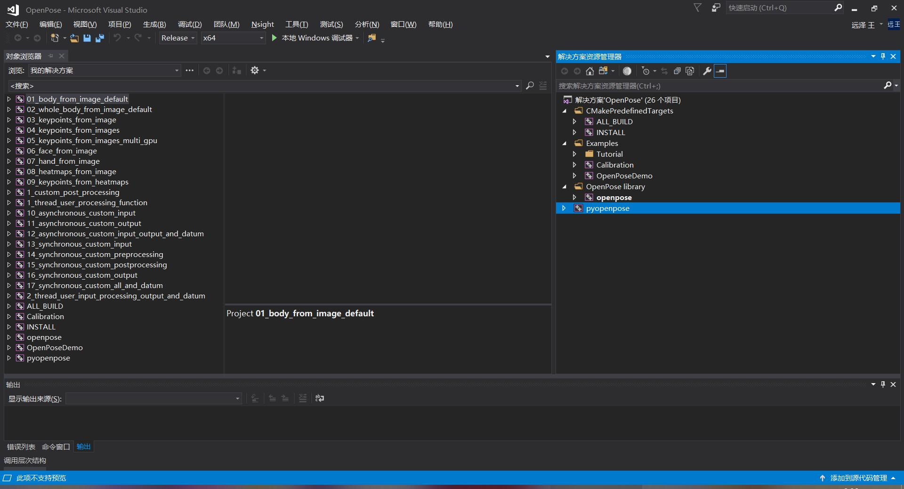

# Contents  

# openpose开源项目配置
## 安装TENSORFLOW（GPU版本）
1.查看自己电脑的GPU型号：
`此电脑`->`管理`->`设备管理器`->`显示适配器`
2.在谷歌搜索：`你的GPU型号 specification`，在官网查它是否支持CUDA。例

3.根据相应版本下载对应的cuDNN和CUDA，并安装
https://www.tensorflow.org/install/source_windows
`python3.79`+`cuDNN7.42`+`CUDA10.0`+

4.在安装CUDA前，需要安装相应版本visual studio（VS），例如CUDA10.0对应VS2017（Enterprise）。安装完成后，在terminal输入nvcc -V，如果显示如下，证明你安装成功了。

5.cuDNN下载下来的是一个压缩包，解压以后，将`..\cuDNN\cuda\bin`配置到环境变量中去。
之后，复制粘贴cuDNN里面的下面三个文件到CUDA的相应同名文件，完成安装。

***

## 依赖工具
`CUDA 10.0`+`cuDNN`+`Visual Studio`+`CMake`。前三个已经在前面的步骤下载好了！！！
在GitHub上clone openpose 源代码，https://github.com/CMU-Perceptual-Computing-Lab/openpose
***

## CMake配置之前的准备工作
去网上找相应版本的文件！！！放到指定的文件夹中

`pose_iter_116000.caffemodel`放入`\openpose\models\face`
`pose_iter_584000.caffemodel`放入`\openpose\models\pose\body_25`
`pose_iter_102000.caffemodel`放入`\openpose\models\hand`

`pybind11-master.zip`解压后放入`openpose\3rdparty\pybind11`
`caffe_15_2020_04_05.zip`+`caffe3rdparty_15_2019_03_14.zip`+`opencv_420_v14_15_2020_04_04.zip`解压后放入`..\openpose\3rdparty\windows`

## CMake配置
1.打开CMake，设置源代码位置为`D:\openpose`，并新建`D:\openpose\build`文件夹，用作编译文件夹。接下来，点击`Configure`按钮，选择你安装的`VS版本`，并选择平台为`x64`，点击`Finish`即可。

2.勾选上方变量中的BUILD_PYTHON。并点击

点击Genetate按钮，生成VS工程文件，并点击Open Project来打开工程，并在上方Target中选择Release。

直接右键点击pyopenpose项目，点击生成即可。
3.看到生成成功的提示后，我们可以在D:\openpose\build\python\openpose\Release目录中找到pyopenpose.cp37-win_amd64.pyd
4.恭喜你，安装成功